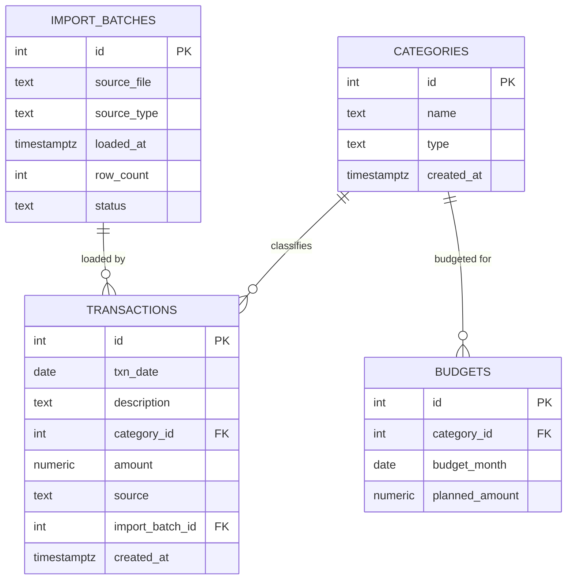

# Phase 1 — Schema Design

Conventions in this doc inherit from [`PROJECT_PLAN.md`](../PROJECT_PLAN.md) and are
binding for every later phase.

## Goal

Translate the existing Excel workbook into a normalized PostgreSQL schema that
becomes the pipeline's single source of truth, replacing the sheet-formula logic
with real tables, constraints, and lineage tracking.

## Source structure (reverse-engineered from the original workbook)

| Sheet | Structure | Notes |
|---|---|---|
| `Expense Tracker` | Table: `Date`, `Description`, `Category`, `Amount (CAD)` | One row per transaction, entered manually. Amount is signed — income positive, expenses negative. |
| `Categories` | Single-column list (`Names`) | 13 flat values (`Income`, `Transportation`, `Groceries`, `Eating Out`, `Subscriptions`, `Fees`, `Brenna`, `Entertainment`, `Treats`, `Savings`, `Investments`, `Emergency Fund`, `Miscellaneous`). Feeds a dropdown data-validation rule on `Expense Tracker!Category`. No subcategories. |
| `Monthly Budget Summary` | Table: `Category`, `Planned (CAD)`, `Actual (CAD)`, `Difference (CAD)` | `Actual` is `=SUMIFS('Expense Tracker'!$D:$D, 'Expense Tracker'!$C:$C, [Category])`; `Difference` is `Actual − Planned`; a `Total` row sums both. The workbook itself is regenerated monthly (filename carries the month), which means `Planned` is edited per month rather than fixed. |

## Design decisions

- **Categories become a dimension table**, not a hardcoded list, so adding a new
  category is a row insert, not an application change.
- **`Income` is modeled as a category with `type = 'income'`**; every other category
  is `type = 'expense'`. This preserves the sheet's existing signed-amount
  convention instead of adding a redundant transaction-level type column.
- **Planned budgets are stored per `(category, month)`**, not as a single fixed
  number, because the source file itself is regenerated monthly and the planned
  amount is editable each time. A `UNIQUE (category_id, budget_month)` constraint
  still guarantees exactly one plan per category per month.
- **Every transaction links to an `import_batches` row**, giving the pipeline
  lineage — which file loaded a row, when, and how many rows came with it — and
  setting up cleanly for a second source (e.g. a bank CSV) later without a schema
  change, only a new `source` value.
- **No DB-level trigger enforcing "amount sign matches category type."** That
  validation belongs in the Phase 2 ingestion script, where a bad row can be
  rejected with a useful error before it ever reaches the database. Keeping the
  schema itself free of business-logic triggers is a deliberate scope decision,
  documented here rather than left implicit.

## Entity-relationship diagram



## Table definitions

### `categories`

| Column | Type | Constraints | Notes |
|---|---|---|---|
| `id` | `SERIAL` | `PRIMARY KEY` | |
| `name` | `TEXT` | `NOT NULL UNIQUE` | e.g. `Eating Out`, `Brenna` |
| `type` | `TEXT` | `NOT NULL CHECK (type IN ('income','expense'))` | Drives the sign convention downstream |
| `created_at` | `TIMESTAMPTZ` | `NOT NULL DEFAULT now()` | |

### `budgets`

| Column | Type | Constraints | Notes |
|---|---|---|---|
| `id` | `SERIAL` | `PRIMARY KEY` | |
| `category_id` | `INTEGER` | `NOT NULL REFERENCES categories(id) ON DELETE RESTRICT` | |
| `budget_month` | `DATE` | `NOT NULL`, day forced to 1 | Represents the whole month, e.g. `2026-08-01` |
| `planned_amount` | `NUMERIC(10,2)` | `NOT NULL` | Signed, same convention as `transactions.amount` |

Unique on `(category_id, budget_month)` — one plan per category per month.
Indexed on `budget_month` for the actual-vs-planned rollup query.

### `transactions`

| Column | Type | Constraints | Notes |
|---|---|---|---|
| `id` | `SERIAL` | `PRIMARY KEY` | |
| `txn_date` | `DATE` | `NOT NULL` | |
| `description` | `TEXT` | `NOT NULL` | |
| `category_id` | `INTEGER` | `NOT NULL REFERENCES categories(id) ON DELETE RESTRICT` | |
| `amount` | `NUMERIC(10,2)` | `NOT NULL` | Signed: positive income, negative expense |
| `source` | `TEXT` | `NOT NULL DEFAULT 'manual' CHECK (source IN ('manual','td_csv'))` | `td_csv` reserved for a future chequing-account feed |
| `import_batch_id` | `INTEGER` | `REFERENCES import_batches(id) ON DELETE SET NULL` | Nullable — a batch can be deleted without deleting its transactions |
| `created_at` | `TIMESTAMPTZ` | `NOT NULL DEFAULT now()` | |

Indexed on `txn_date` and `category_id` — the two columns every rollup query
filters or groups on.

### `import_batches`

| Column | Type | Constraints | Notes |
|---|---|---|---|
| `id` | `SERIAL` | `PRIMARY KEY` | |
| `source_file` | `TEXT` | `NOT NULL` | e.g. `monthly_spreadsheet__Aug_26_.xlsx` |
| `source_type` | `TEXT` | `NOT NULL DEFAULT 'excel_manual'` | |
| `loaded_at` | `TIMESTAMPTZ` | `NOT NULL DEFAULT now()` | |
| `row_count` | `INTEGER` | | Rows successfully loaded |
| `status` | `TEXT` | `NOT NULL DEFAULT 'success' CHECK (status IN ('success','partial','failed'))` | |

## Migrations

Schema is applied via [dbmate](https://github.com/amacneil/dbmate) in dependency
order, one object per file:

| File | Creates |
|---|---|
| `db/migrations/20260816120000_create_categories.sql` | `categories` |
| `db/migrations/20260816120001_create_import_batches.sql` | `import_batches` |
| `db/migrations/20260816120002_create_budgets.sql` | `budgets` |
| `db/migrations/20260816120003_create_transactions.sql` | `transactions` |

Each has a matching `-- migrate:down` that drops the table, so the schema can be
rolled back cleanly during development.

## Local & cloud setup

```bash
docker compose up -d                        # local Postgres on :5432
cp .env.example .env                        # fill in DATABASE_URL / NEON_DATABASE_URL
dbmate --url "$DATABASE_URL" up             # apply migrations locally
dbmate --url "$NEON_DATABASE_URL" up        # apply the same migrations to Neon
psql "$DATABASE_URL" -f db/seed_categories.sql
```

## Verification

Once seeded, this query should reproduce the `Monthly Budget Summary` sheet's
`Actual (CAD)` column exactly, for any month already loaded:

```sql
SELECT c.name AS category,
       SUM(t.amount) AS actual
FROM transactions t
JOIN categories c ON c.id = t.category_id
WHERE date_trunc('month', t.txn_date) = '2026-08-01'
GROUP BY c.name
ORDER BY c.name;
```

Matching this against the source workbook, category by category, is the
acceptance test for Phase 1 before any ingestion code is written against the schema.

## Next

Phase 2 builds the ingestion script that reads a monthly workbook, validates each
row (including the amount-sign-matches-category-type rule deferred from this
phase), records an `import_batches` row, and upserts into `transactions`.
