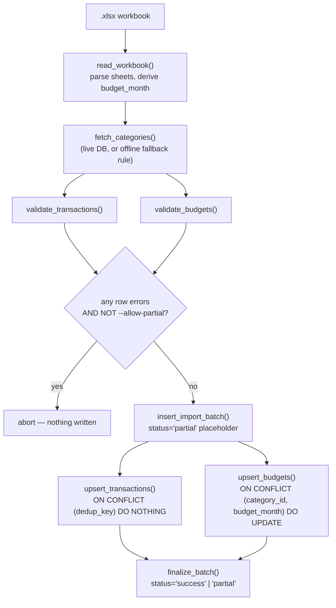

# Phase 2 — Ingestion

Conventions in this doc inherit from [`PROJECT_PLAN.md`](../PROJECT_PLAN.md) and
[`phase-1-schema-design.md`](phase-1-schema-design.md) and are binding for later phases.

## Goal

Build a repeatable script that reads a monthly workbook, validates every row against
the rules Phase 1 deliberately deferred out of the database, records lineage via
`import_batches`, and upserts into `transactions` and `budgets` — replacing "open the
file and eyeball it" with something that can run unattended in Phase 4.

## Source reconciliation

Phase 1's source-structure table was reverse-engineered from the workbook shape; this
phase re-checked it directly against `monthly_spreadsheet_Aug_26.xlsx` before writing
any ingestion code, since a design built on a misremembered column name fails quietly.
Findings:

| Check | Result |
|---|---|
| Sheet names | `Monthly Budget Summary`, `Expense Tracker`, `Categories` — exact match |
| `Expense Tracker` columns | `Date`, `Description`, `Category`, `Amount (CAD)` — exact match, no nulls in any column |
| `Monthly Budget Summary` columns | `Category`, `Planned (CAD)`, `Actual (CAD)`, `Difference (CAD)`, plus a `Total` row — exact match |
| Sign convention | Verified on all 50 transaction rows: every `Income` row is positive, every other row is negative. No violations in the current file. |
| Exact-duplicate rows | None (checked on the full `Date`/`Description`/`Category`/`Amount` tuple) |
| Category values used | All 9 categories present in `Expense Tracker` (`Income`, `Transportation`, `Groceries`, `Eating Out`, `Subscriptions`, `Brenna`, `Entertainment`, `Treats`, `Miscellaneous`) are a subset of the 13 in `Categories` — no stray values |
| Filename convention | `monthly_spreadsheet_Aug_26.xlsx`, not the `monthly_spreadsheet__Aug_26_.xlsx` shape implied by the Phase 1 example — the ingestion filename parser below matches the real convention, not the doc example |

One gap the real file surfaced that Phase 1 didn't need to resolve: **the workbook
never states its own month.** `Monthly Budget Summary` has no date column, and
`Expense Tracker` dates only pin the month indirectly. The only explicit signal is the
filename. That gap, and the fix, are covered below.

## Design decisions

- **The month comes from the filename, cross-checked against transaction dates, not
  trusted blindly.** `derive_budget_month()` parses `monthly_spreadsheet_<Mon>_<YY>.xlsx`
  into a `date`, and every transaction row whose month doesn't match is rejected as a
  row-level error rather than silently filed under the wrong month. `--budget-month`
  exists as an explicit override for the day the filename convention inevitably breaks.

- **Re-running ingestion on the same file is the normal case, not a failure mode.**
  Per `PROJECT_PLAN.md`, the workbook is edited by hand throughout the month, not
  written once — so the pipeline has to be safe to run daily against a file that's
  slowly growing. This is the main design constraint on everything below.

- **`transactions` needed a natural key it didn't have.** Phase 1 shipped it with only
  a surrogate `id`, which is fine for a single load but can't express "skip rows
  already loaded" on a re-run. Rather than hand-roll a diff against what's already in
  the database, `create_transactions` includes a generated, stored `dedup_key`
  (`md5` of date + description + category + amount + source) with a unique index, so
  the loader can express idempotency as a single `ON CONFLICT (dedup_key) DO NOTHING`.
  Folded into the original create migration (instead of a follow-up `ALTER`) because
  the table still has no production data and the create file can be re-applied from
  a clean database.

- **Budgets are upserted, not append-only.** `Planned (CAD)` is the one column in the
  source workbook that's expected to be edited in place mid-month. `ON CONFLICT
  (category_id, budget_month) DO UPDATE` (the unique constraint Phase 1 already
  defined) keeps the database in sync with whatever the sheet says right now, instead
  of accumulating stale planned-amount history the schema has nowhere to put anyway.

- **Categories are validated against, never created from, the sheet.** An unrecognized
  category string is a row-level error, full stop. Silently inserting a new category
  row because someone fat-fingered `"Eatting Out"` would corrupt the dimension table
  invisibly; a rejected row with a clear message is recoverable, a phantom category
  isn't.

- **Strict-by-default, with an explicit escape hatch.** If any row fails validation,
  the whole batch aborts and nothing is written — matching the "no silent data loss on
  a personal finance dataset" principle from `PROJECT_PLAN.md`'s FK convention. Passing
  `--allow-partial` loads everything that *did* validate and records the batch as
  `status = 'partial'`, for the case where you know a stray row is bad and want the
  rest in now.

- **`--dry-run` works without a database.** It tries a live connection first — real
  category IDs are strictly better than the fallback — but if none is configured, it
  falls back to the one rule Phase 1 already documented (`Income` is the sole
  income-type category, everything else is expense-type) rather than refusing to run.
  This is what let the script below be verified against the real workbook without a
  Postgres instance on hand; see [Verification](#verification).

## Pipeline flow



## Script structure

```
ingest/
├── __init__.py
├── config.py      # resolves DATABASE_URL / NEON_DATABASE_URL from --env
├── parser.py       # read_workbook(), derive_budget_month(), structural checks
├── validator.py     # validate_transactions(), validate_budgets(), sign-convention rule
├── loader.py        # DB writes: import_batches, transaction/budget upserts
└── cli.py           # argparse entrypoint, orchestration, logging
```

| Module | Responsibility | Fails how |
|---|---|---|
| `parser.py` | Structural integrity of the file itself — right sheets, right columns, parseable filename | Raises `WorkbookError`, aborts before any row logic runs |
| `validator.py` | Row-level business rules — sign convention, known category, non-empty fields, date-in-month | Returns per-row errors; caller decides strict-abort vs. `--allow-partial` |
| `loader.py` | All SQL — batch lineage row, idempotent upserts | Raises on connection/DB errors; batch row is finalized as `'failed'` even then |
| `cli.py` | Wires the above together, prints a summary, sets the process exit code | `0` clean, `1` hard failure (bad file / DB / aborted strict batch), `2` dry-run found row errors |

## Usage

```bash
pip install -r requirements.txt

# Validate only, no DB writes — safe to run anytime, works even without a database
python -m ingest.cli --file monthly_spreadsheet_Aug_26.xlsx --dry-run

# Load into local Docker Postgres
python -m ingest.cli --file monthly_spreadsheet_Aug_26.xlsx --env local

# Load into Neon, tolerating known-bad rows
python -m ingest.cli --file monthly_spreadsheet_Aug_26.xlsx --env neon --allow-partial

# Re-run later in the month against the same, now-larger file — already-loaded
# rows are skipped via dedup_key; only genuinely new rows get inserted
python -m ingest.cli --file monthly_spreadsheet_Aug_26.xlsx --env local
```

## Verification

Run against the real `monthly_spreadsheet_Aug_26.xlsx`, no database configured:

```
INFO Parsed monthly_spreadsheet_Aug_26.xlsx -- budget month 2026-08
WARNING No database connection available (...) -- falling back to the
        documented sign-convention rule for category types.
INFO Validation: 50/50 transaction rows valid, 13/14 budget rows valid
INFO Dry run complete -- no database writes performed.
```

50/50 transactions and 13/13 real budget categories (the 14th row, `Total`, is
correctly excluded, not counted as invalid) — consistent with the source
reconciliation table above. Two negative-path checks were also run against
deliberately corrupted copies of the same file to confirm the validator actually
catches problems rather than passing everything by default:

- An unrecognized category (`Category` changed to `NotACategory`) → rejected with
  `unrecognized category 'NotACategory' (not in categories dimension)`, 49/50 valid.
- A sign-convention violation (a `Brenna` row's amount flipped positive) → rejected
  with `category 'Brenna' is expense-type but amount is positive (999.99)`, 49/50 valid.

Once applied to a live database, the acceptance test is the same one Phase 1 defined:
the `SELECT ... GROUP BY c.name` rollup query in `phase-1-schema-design.md` should
reproduce `Monthly Budget Summary`'s `Actual (CAD)` column exactly after ingesting a
month's file.

## Local & cloud setup

```bash
# Apply migrations (includes transactions.dedup_key on CREATE TABLE)
dbmate --url "$DATABASE_URL" up
dbmate --url "$NEON_DATABASE_URL" up

# Install ingestion dependencies
pip install -r requirements.txt

# Copy env template (adds nothing new over Phase 1 — same two variables — but
# now DATABASE_URL/NEON_DATABASE_URL are read by the ingestion script too)
cp .env.example .env
```

`requirements.txt` (new in this phase):

```
pandas>=2.2
openpyxl>=3.1
psycopg2-binary>=2.9
python-dotenv>=1.0
```

## Open questions carried into Phase 3

- **Reconciling `Actual (CAD)` post-ingestion.** The sheet computes `Actual` via
  `SUMIFS`; Phase 3's dbt models are meant to replace that logic, but this phase's
  verification query already reproduces it manually. Worth deciding in Phase 3 whether
  `Difference (CAD)` becomes a dbt model or stays a query-time calculation.
- **Multi-file backfill.** This phase's CLI takes one `--file` at a time. Backfilling
  several historical months means either a shell loop over the CLI as-is, or a small
  `--glob` addition — deferred until there's an actual backlog of old workbooks to load.

## Next

Phase 3 replaces the sheet's `SUMIFS`/`Difference` formulas with versioned dbt models
reading from `transactions` and `budgets`, now that both are populated by a real
pipeline instead of manual entry.
