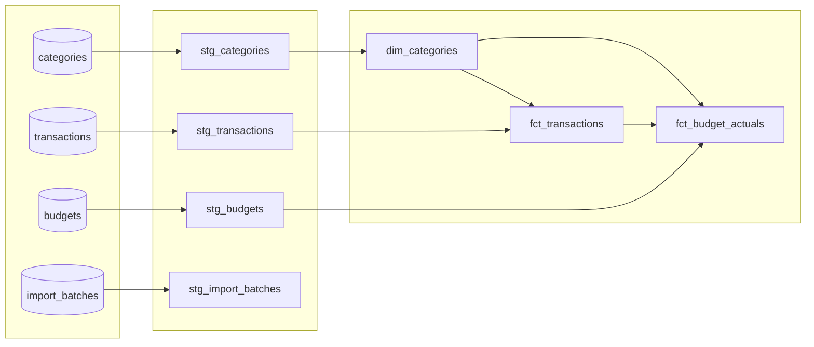

# Phase 3 — Transformation (dbt)

Conventions in this doc inherit from [`PROJECT_PLAN.md`](../PROJECT_PLAN.md),
[`phase-1-schema-design.md`](phase-1-schema-design.md), and
[`phase-2-ingestion.md`](phase-2-ingestion.md), and are binding for later phases.

## Goal

Replace the source workbook's `Monthly Budget Summary` sheet — a `SUMIFS` over
`Expense Tracker` plus a `Difference` formula — with versioned, tested dbt models
reading from `transactions` and `budgets`, now that Phase 2 populates both for real.
This also closes the one open question Phase 2 explicitly deferred: whether
`Actual (CAD)` / `Difference (CAD)` become a dbt model or stay a query-time
calculation. They become a model — `fct_budget_actuals` — for the reasons below.

## What dbt reads

dbt treats the four Phase 1/2 tables as read-only **sources**; nothing in this
project writes back to them.

| Source table | Populated by | Notes |
|---|---|---|
| `categories` | `db/seed_categories.sql` (Phase 1) | Static dimension, 13 rows |
| `transactions` | `ingest/loader.py::upsert_transactions` (Phase 2) | Idempotent on `dedup_key` |
| `budgets` | `ingest/loader.py::upsert_budgets` (Phase 2) | `planned_amount` overwritten in place per re-run |
| `import_batches` | `ingest/loader.py` (Phase 2) | Lineage; staged but not yet used by a mart |

## Design decisions

- **Two layers: staging, then marts.** Staging models (`stg_*`) are 1:1 views over
  the raw tables — renamed to `snake_case` business names, lightly typed, no joins,
  no aggregation. Marts (`dim_*` / `fct_*`) are the business-facing tables everything
  else reads. This is the standard dbt split, and it earns its keep here specifically
  because it gives Phase 5's dashboard (and this project's own tests) one place to
  absorb a source rename or retype without touching every downstream model twice.

- **`Actual`/`Difference` become a model, not a query-time calculation.** Phase 2
  left this open deliberately. A versioned model (`fct_budget_actuals`) can carry its
  own tests — uniqueness on `(category, month)`, non-null actuals — and gives Phase 5
  one stable table to point a dashboard at, instead of every consumer re-deriving the
  `SUMIFS` logic independently. The trade-off is one more object to keep in sync with
  the schema; acceptable at this scale, and reversible if it ever isn't.

- **`fct_budget_actuals` full-outer-joins budgets and summed actuals**, rather than
  joining off either side alone. A category with a plan but zero spend this month, and
  a category with spend but no plan entered, both need to appear. The source sheet's
  `SUMIFS` never had to handle the second case — `Planned` was always the driving list
  by construction — but a general-purpose model can't assume that stays true forever.

- **`planned_amount` stays nullable in the mart, not coalesced to 0.** "No plan
  entered for this category this month" and "planned to spend exactly $0" are
  different facts, and collapsing them would quietly discard the first one.
  `difference_amount` still needs a real number, so *it* coalesces the null to 0 —
  the nullability is preserved on `planned_amount` itself, and only resolved at the
  point that actually requires a number.

- **A singular dbt test re-checks the amount-sign-vs-category-type rule** (the same
  rule `ingest/validator.py` enforces, and the same rule Phase 1 deliberately kept out
  of a DB trigger) at the transform layer. This is a second, independent check —
  `ingest/validator.py` only protects rows written through the CLI; a table that's
  ever written some other way (manual `psql`, a future loader) has nothing else
  guarding it before it reaches a mart.

- **Custom `generate_schema_name` macro.** dbt's default behavior appends a model's
  custom `+schema` config onto the connection's target schema (`public_staging`,
  `public_marts`). Overridden here so `staging`/`marts` tables land in schemas named
  exactly that, in both local and Neon Postgres — matching what a future dashboard
  query or an ad hoc `psql` session would expect to find, and matching this doc.

- **Local and Neon share one dbt project, switched with `--target`.** Same pattern as
  `--env` on `ingest/cli.py` and `--url` on `dbmate` — one more place using the
  local/neon split, not a new mental model to learn.

- **dbt's own dependencies live in `dbt/requirements.txt`, separate from the root
  `requirements.txt`.** dbt-core pins a lot of its own transitive dependencies
  (Jinja2, click, etc.); keeping it out of the ingestion script's environment avoids
  a future version conflict between the two. A separate virtualenv under `dbt/` is
  the recommended setup — see `dbt/README.md`.

- **`categories` is a dbt *source*, not a dbt *seed*.** It's already seeded once via
  `db/seed_categories.sql` (Phase 1's decision: categories are validated against,
  never created from, the workbook). Re-seeding it again via a dbt seed CSV would
  give two tools two independent places to define the same 13 rows, which is exactly
  the kind of drift Phase 1 was trying to avoid.

## Project layout

```
dbt/
├── dbt_project.yml
├── packages.yml            # dbt_utils
├── profiles.yml.example    # copy to profiles.yml, gitignored
├── requirements.txt
├── README.md
├── macros/
│   └── generate_schema_name.sql
├── models/
│   ├── staging/
│   │   ├── _staging__sources.yml
│   │   ├── _staging__models.yml
│   │   ├── stg_categories.sql
│   │   ├── stg_transactions.sql
│   │   ├── stg_budgets.sql
│   │   └── stg_import_batches.sql
│   └── marts/
│       ├── _marts__models.yml
│       ├── dim_categories.sql
│       ├── fct_transactions.sql
│       └── fct_budget_actuals.sql
└── tests/
    └── assert_transaction_sign_matches_category_type.sql
```

## Model DAG



## Models

| Model | Layer | Materialization | Grain | Purpose |
|---|---|---|---|---|
| `stg_categories` | staging | view | 1 row / category | Renamed pass-through of `categories` |
| `stg_transactions` | staging | view | 1 row / transaction | Renamed pass-through of `transactions` |
| `stg_budgets` | staging | view | 1 row / (category, month) plan | Renamed pass-through of `budgets` |
| `stg_import_batches` | staging | view | 1 row / ingestion run | Renamed pass-through of `import_batches`; not yet consumed downstream |
| `dim_categories` | marts | table | 1 row / category | Category dimension consumers join against |
| `fct_transactions` | marts | table | 1 row / transaction | Transactions denormalized with category name/type |
| `fct_budget_actuals` | marts | table | 1 row / (category, month) | Planned vs. actual vs. difference — the `Monthly Budget Summary` replacement |

## Testing strategy

Every model has an owning `.yml` file with, at minimum, a `unique`/`not_null` test
on its grain column(s) — a model with no tests is treated as a bug at review time,
not a starting point to add tests to later. Beyond that:

- **`sources.yml`**: `unique`/`not_null` on primary keys, `accepted_values` on
  `categories.type`, `budgets.status` (via `import_batches`), and `relationships`
  tests tying `transactions.category_id` / `budgets.category_id` back to `categories`
  — the same foreign keys Phase 1 already enforces in Postgres, re-checked at the
  transform layer.
- **`source freshness`**: configured on `transactions` (warn at 45 days, error at 90)
  so a stalled ingestion pipeline is visible before Phase 4 has a scheduler to make it
  loud automatically.
- **`fct_budget_actuals`**: a `dbt_utils.unique_combination_of_columns` test on
  `(category_id, budget_month)`, mirroring the `budgets_unique_category_month`
  constraint from Phase 1 — if this ever fires, the full outer join has a bug, not
  the data.
- **Singular test**: `assert_transaction_sign_matches_category_type.sql`, the
  transform-layer re-check of the sign-convention rule described above.

Run `dbt test` for tests alone, or `dbt build` to run models and tests together in
dependency order — `dbt build` is what CI (Phase 4) will call.

## Naming conventions (additions binding for this phase)

- Staging models are prefixed `stg_`, one per source table, 1:1 grain — renaming and
  casting only, never joins or aggregation.
- Mart dimension tables are prefixed `dim_`; fact tables are prefixed `fct_`.
- Schema files are prefixed with an underscore (`_staging__sources.yml`,
  `_marts__models.yml`) so they sort above the SQL files they document in a
  directory listing.

## Usage

```bash
cd dbt
python -m venv .venv && source .venv/bin/activate
pip install -r requirements.txt
dbt deps                                 # installs dbt_utils

cp profiles.yml.example profiles.yml     # fill in real values; gitignored
dbt debug --target local                 # sanity-check the connection

dbt build --target local                 # build + test staging and marts, local Docker Postgres
dbt build --target neon                  # same models, against Neon
```

dbt creates the `staging` and `marts` schemas on first run if they don't already
exist, which requires the connecting role to have `CREATE` on the database — true by
default for `budget_admin` locally and for a Neon free-tier project's own user.

## Verification

Mirrors Phase 1's acceptance test. After `dbt build`, this should reproduce the
source workbook's `Actual (CAD)` / `Difference (CAD)` columns exactly, for any month
already loaded:

```sql
SELECT category_name, budget_month, planned_amount, actual_amount, difference_amount
FROM marts.fct_budget_actuals
WHERE budget_month = '2026-08-01'
ORDER BY category_name;
```

`fct_budget_actuals.actual_amount` is summed from `fct_transactions`, which is
itself a re-projection of the same `transactions` rows Phase 1's manual verification
query reads directly — so the two are expected to match exactly. Any drift means a
bug in the mart, not a data problem, and is the first thing to check before touching
anything upstream.

## Open questions carried into Phase 4

- **Scheduling.** Whether `dbt build` runs as a separate step after
  `python -m ingest.cli` in the same GitHub Actions workflow, or as its own workflow
  — decide when Phase 4 designs the orchestration DAG.
- **Source freshness as a CI gate.** `dbt source freshness` is configured but nothing
  runs it on a schedule yet; worth deciding once Phase 4 exists to run it.
- **Planned-amount history.** `budgets.planned_amount` is overwritten in place on
  every re-run (Phase 2's decision), so nothing — dbt included — can currently show
  "what was planned as of last week." A dbt snapshot would fix this if that history
  ever turns out to matter; not built now because nothing needs it yet.

## Next

Phase 4 wires `python -m ingest.cli` and `dbt build` into a scheduled GitHub Actions
workflow, so a new monthly workbook is ingested and transformed without either
command being run by hand.
