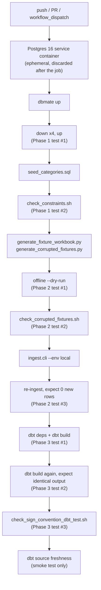
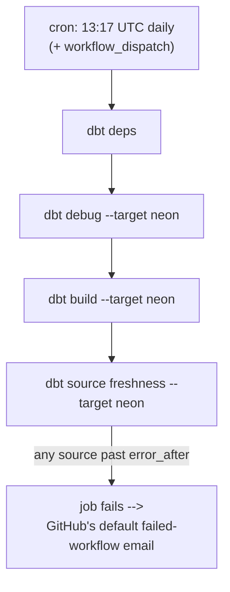

# Phase 4 — Orchestration (GitHub Actions)

Conventions in this doc inherit from [`PROJECT_PLAN.md`](../PROJECT_PLAN.md),
[`phase-1-schema-design.md`](phase-1-schema-design.md),
[`phase-2-ingestion.md`](phase-2-ingestion.md), and
[`phase-3-transformation.md`](phase-3-transformation.md), and are binding for
later phases.

## Goal

Replace "run `ingest.cli` and `dbt build` by hand" with two scheduled/triggered
GitHub Actions workflows: a **CI regression suite** that proves the pipeline code
itself still works on every push, and a **scheduled Neon refresh** that keeps
`marts.fct_budget_actuals` current and surfaces a stalled pipeline automatically —
closing the two open questions Phase 3 left for this phase (scheduling, and source
freshness as a CI gate).

## The constraint this phase is designed around

The monthly workbook is real personal financial data. `.gitignore` excludes every
`*.xlsx` from the repo by design (see `PROJECT_PLAN.md`'s "Source data" row), which
means **the real workbook never reaches GitHub Actions** — there is no file for a
GitHub-hosted runner to ingest, and this phase does not try to invent a way to get
one there (no cloud-storage secret, no artifact upload of financial data — that
would be solving a problem PROJECT_PLAN.md deliberately avoided by keeping source
data out of the repo in the first place).

That reframes what "orchestration" means for this project. It splits into two
genuinely different jobs, which is why this phase ships two workflows instead of
one:

| Job | Needs the real workbook? | Runs against | Trigger |
|---|---|---|---|
| Prove the pipeline code works | No — a synthetic fixture stands in | Ephemeral Postgres (GitHub-hosted service container) | Every push/PR |
| Keep production marts current | No — re-reads what's already in `transactions`/`budgets` | Neon | Scheduled (daily) |

`python -m ingest.cli --file <workbook> --env neon`, run locally after editing the
workbook, stays a manual step — same as it's been since Phase 2. That single command
is genuinely the fastest correct design here: automating it would mean either
committing financial data or standing up a second, non-free piece of infrastructure
(an upload endpoint, a cloud-storage poll) to solve a problem that doesn't otherwise
exist. See [What this doesn't automate](#what-this-doesnt-automate).

## Design decisions

- **Two workflows, not one, because they have genuinely different trust levels and
  cadences.** `ci.yml` runs on every push against throwaway, secret-free infrastructure
  — anyone who forks the repo and opens a PR gets the same regression coverage with
  zero setup. `scheduled-refresh.yml` runs on a timer against the real Neon database
  and needs real credentials. Merging them into one workflow would mean either giving
  every PR access to Neon secrets (a real credential-exposure risk on public forks) or
  gating the CI suite behind secrets that a fresh clone doesn't have yet — both worse
  than two small, single-purpose files.

- **CI fixtures are generated fresh every run, never committed.** `scripts/ci/`
  builds the fixture workbook (and its five corrupted variants) with `openpyxl` as a
  workflow step, rather than checking in `.xlsx` binaries. This keeps `.gitignore`'s
  blanket `*.xlsx` rule simple (no exception needed for test fixtures living
  alongside real, never-committed ones), and it means the dataset a reviewer actually
  reads — `scripts/ci/fixture_data.py` — is the same dataset CI runs against; there's
  no binary file that can quietly drift from it.

- **The fixture month is a fixed, historical one (January 2025), not "last month."**
  Deterministic CI output matters more than realism here — a relative month would
  make `dbt source freshness`'s pass/warn/error thresholds (see Phase 3) shift
  depending on when CI happens to run, which is exactly the kind of flakiness a
  regression suite exists to avoid.

- **Corrupted fixtures live one-per-directory, not one-per-filename.**
  `ingest/parser.py::derive_budget_month()` parses the budget month out of the
  filename itself (`monthly_spreadsheet_<Mon>_<YY>.xlsx`) — see
  `docs/phase-2-ingestion.md`. Giving every corrupted fixture a real, correctly-named
  file inside its own case directory (`tests/fixtures/corrupted/blank_description/
  monthly_spreadsheet_Jan_25.xlsx`) means CI exercises that exact real-world code
  path, instead of needing a `--budget-month` override that only exists for CI's
  benefit.

- **CI reuses the `local` dbt/psql target instead of adding a third `ci` one.**
  `dbt/profiles.yml.example`'s `local` target already is "host from an env var-driven
  password, `budget_admin`, `budget_pipeline`, port 5432" — exactly what a Postgres
  service container looks like from the job runner's point of view. Same reasoning
  as `PROJECT_PLAN.md`'s original local/Neon split: one more environment name to
  remember isn't worth it when the existing one already fits.

- **CI installs both `requirements.txt` and `dbt/requirements.txt` into one
  environment, not two.** Phase 3 keeps them in separate virtualenvs specifically so
  a persistent local dev machine doesn't accumulate a dependency conflict between
  dbt-core's pins and the ingestion script's pins over time. A GitHub Actions job is
  thrown away after every run, so there's nothing for a conflict to accumulate
  *into* — and as of this phase, installing both together produces zero `pip check`
  conflicts anyway. Worth revisiting only if that ever stops being true.

- **The scheduled workflow rebuilds marts and checks freshness — it does not
  ingest.** See [The constraint this phase is designed around](#the-constraint-this-phase-is-designed-around).
  `dbt build --target neon` re-derives every mart from whatever's already in
  `transactions`/`budgets`, so it's useful (and safe to run unconditionally on a
  timer) even on a day nothing new was ingested.

- **`dbt source freshness` failing the scheduled job *is* the alert.** No separate
  notification integration — a failed GitHub Actions workflow already emails the
  repo owner by default, which is the free, zero-maintenance option `PROJECT_PLAN.md`
  has favored throughout. If that default notification ever proves insufficient, a
  Slack/webhook step is a small addition to `scheduled-refresh.yml`, not a redesign.

- **The CI Postgres password is a plain workflow-level value, not a GitHub secret.**
  It authenticates a container that exists for the duration of one job and is
  discarded afterward — treating it as a secret would suggest a confidentiality
  requirement that doesn't actually apply here. Neon's credentials, which protect
  real data, *are* secrets (see [Setup](#setup)).

## What this doesn't automate

- **Real ingestion.** Stays `python -m ingest.cli --env neon`, run locally after
  editing the workbook. See the constraint section above.
- **Multi-file backfill.** Still the open item `phase-2-ingestion.md` deferred — an
  actual backlog of historical workbooks would need either a shell loop over the CLI
  or a `--glob` addition, neither of which this phase's fixtures or workflows
  exercise.
- **Alerting beyond GitHub's own failed-workflow email.** See the freshness decision
  above.

## Workflows

```
.github/workflows/
├── ci.yml                  # push/PR -- full Phases 1-3 regression, ephemeral DB
└── scheduled-refresh.yml   # daily cron -- dbt build + source freshness, Neon
```

### `ci.yml`



Every step is labeled in `ci.yml` with the `docs/testing-guide.md` test it
implements, so a failing step points straight back at the regression it broke —
that mapping was the whole point of writing the testing guide before this phase
existed to automate it.

### `scheduled-refresh.yml`



## Project layout

```
.github/
└── workflows/
    ├── ci.yml
    └── scheduled-refresh.yml
scripts/
└── ci/
    ├── fixture_data.py                    # canonical synthetic dataset
    ├── generate_fixture_workbook.py        # builds the base fixture
    ├── generate_corrupted_fixtures.py      # 5 corrupted variants, one per validation rule
    ├── check_constraints.sh                # Phase 1 constraint regression
    ├── check_corrupted_fixtures.sh         # Phase 2 row-validation regression
    └── check_sign_convention_dbt_test.sh   # Phase 3 defense-in-depth regression
tests/
└── fixtures/          # generated at CI runtime, gitignored (*.xlsx) -- not committed
    └── corrupted/      # one subdirectory per validation rule, same reason
```

## Fixture dataset

`scripts/ci/fixture_data.py` is the single source of truth `generate_fixture_workbook.py`
and `generate_corrupted_fixtures.py` both build from:

- **25 transactions** across all 13 categories, dated January 2025, correctly
  signed (positive `Income`, negative everything else).
- **13 budget rows**, one `Planned (CAD)` per category — no `Total` row in the
  dataset itself; that derived aggregate is added at write time, matching how the
  real `Monthly Budget Summary` sheet works.
- **5 corrupted variants**, each the full base dataset with exactly one transaction
  row mutated, one per rule in `docs/testing-guide.md`'s Phase 2 validation table:

  | Case directory | Mutation | Expected rejection (substring) |
  |---|---|---|
  | `unrecognized_category/` | Category → `"NotACategory"` | `unrecognized category 'NotACategory'` |
  | `expense_amount_flipped_positive/` | A `Groceries` row's amount flipped positive | `is expense-type but amount is positive` |
  | `income_amount_flipped_negative/` | An `Income` row's amount flipped negative | `is income-type but amount is negative` |
  | `blank_description/` | `Description` set to a genuinely blank cell | `empty description` |
  | `date_outside_budget_month/` | A transaction date moved into February | `not the workbook's budget month` |

  `generate_corrupted_fixtures.py` asserts at generation time that each case
  differs from the base dataset in exactly one row, so a future edit to
  `fixture_data.py` that changes its shape fails loudly instead of silently
  breaking the "N-1/N valid" invariant every case relies on.

- **The blank-description case writes a real `None` cell**, not an empty string —
  using direct list assignment through `ws.append([...])`, which is the safe form of
  the `openpyxl` gotcha already on record in this project (`cell(value=None)` doesn't
  reliably blank a cell; assigning `None` directly through `.value` or `append()`
  does).

## Setup

### CI (`ci.yml`)

Nothing to configure — it runs on any push or PR with no secrets, using a Postgres
service container GitHub provisions per job. A fresh fork gets full regression
coverage immediately.

### Scheduled refresh (`scheduled-refresh.yml`)

Needs four repository secrets, matching `dbt/profiles.yml.example`'s `neon` target
and `.env.example`'s `NEON_PG*` variables exactly — the same four values already
sitting in your local `.env`:

| GitHub secret | Source |
|---|---|
| `NEON_PGHOST` | `.env`'s `NEON_PGHOST` |
| `NEON_PGUSER` | `.env`'s `NEON_PGUSER` |
| `NEON_PGPASSWORD` | `.env`'s `NEON_PGPASSWORD` |
| `NEON_PGDATABASE` | `.env`'s `NEON_PGDATABASE` |

Set under **Settings → Secrets and variables → Actions → New repository secret** in
GitHub. Until these are set, `scheduled-refresh.yml` will fail at the `dbt debug`
step with a clear connection error rather than doing anything destructive.

## Testing strategy

`scripts/ci/check_*.sh` are regression scripts in their own right — each one can be
run locally against `$DATABASE_URL`, exactly as `docs/testing-guide.md` already
describes doing by hand, which is what they were written from:

```bash
# From the repo root, with DATABASE_URL exported and migrations/seed already applied
bash scripts/ci/check_constraints.sh
python scripts/ci/generate_fixture_workbook.py
python scripts/ci/generate_corrupted_fixtures.py
bash scripts/ci/check_corrupted_fixtures.sh

# After `dbt deps` and at least one successful `dbt build --target local`:
DBT_TARGET=local bash scripts/ci/check_sign_convention_dbt_test.sh
```

`ci.yml` is this same sequence, plus the migration-rollback cycle and the dbt build
itself, run automatically against a container Postgres instead of your local Docker
one. Validated end-to-end against a real (non-Docker, directly-installed) local
Postgres 16 instance before being written up here, consistent with this project's
build-before-document approach — every script above ran clean, including the full
migration up → down×4 → up cycle, all six constraint checks, all five corrupted
fixtures producing exactly one correctly-worded rejection each, idempotent
re-ingestion (`0 new transactions inserted (25 already present)`), a clean 58/58
`dbt build`, an identical second `dbt build`, and the sign-convention singular test
failing on a manually-inserted bad row and passing again after cleanup.

## Verification

Once `ci.yml` is green on a push, the same reconciliation Phase 1 and Phase 3
already established holds for the fixture data:

```sql
-- Against the CI Postgres service container, or your own local Docker instance
-- after running the scripts above by hand
SELECT category_name, budget_month, planned_amount, actual_amount, difference_amount
FROM marts.fct_budget_actuals
WHERE budget_month = '2025-01-01'
ORDER BY category_name;
```

Once `NEON_PG*` secrets are set and `scheduled-refresh.yml` has run at least once,
the same query against Neon (`marts.fct_budget_actuals`) should reflect whatever was
last ingested via `ingest.cli --env neon`, no more than one scheduled run stale.

## Open questions carried into Phase 5

- **Dashboard read path.** Phase 5 needs to decide how it connects to Neon —
  directly with its own read-only role, or through a small API layer. Nothing in
  this phase blocks either choice; `marts.fct_budget_actuals` is the stable table
  either way, per `docs/phase-3-transformation.md`.
- **Scheduled-refresh cadence.** Daily was chosen because ingestion itself is
  irregular (whenever the workbook is edited); worth revisiting if a dashboard ends
  up wanting near-real-time freshness after a manual ingest, which would push toward
  a `workflow_dispatch`-triggered refresh immediately after `ingest.cli --env neon`
  instead of (or alongside) the daily cron.
- **Multi-file backfill**, unchanged from Phase 2 — still nothing forcing a decision
  until there's an actual backlog of historical workbooks to load.

## Next

Phase 5 builds a dashboard reading from `marts.fct_budget_actuals` (and
`marts.fct_transactions` for any transaction-level drill-down), replacing the source
workbook's `Monthly Budget Summary` sheet as the thing actually looked at day to day.
