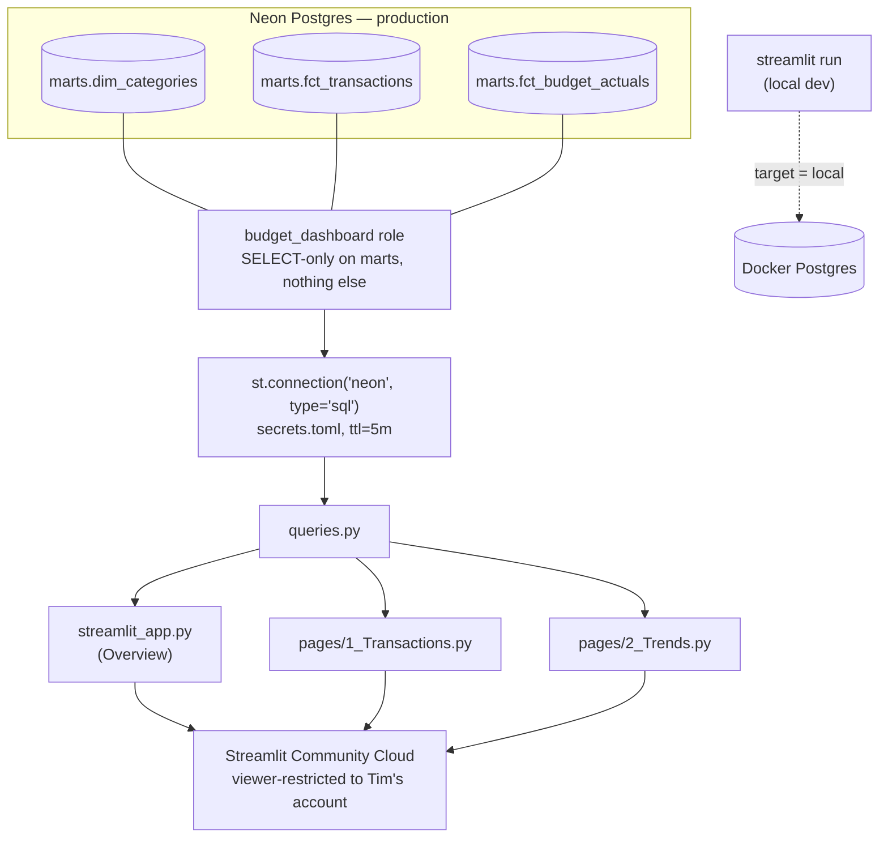

# Phase 5 — Dashboard (Streamlit)

Conventions in this doc inherit from [`PROJECT_PLAN.md`](../PROJECT_PLAN.md),
[`phase-1-schema-design.md`](phase-1-schema-design.md),
[`phase-3-transformation.md`](phase-3-transformation.md), and
[`phase-4-orchestration.md`](phase-4-orchestration.md), and are binding for
Phase 6.

## Goal

Replace "look at `marts.fct_budget_actuals` by running a `psql` query" with an
always-available, private web app — the direct visual replacement for the
source workbook's `Monthly Budget Summary` sheet, plus two views the sheet
never structurally supported: transaction-level drill-down, and multi-month
trends. Phase 1 and Phase 3's verification queries were always meant as
one-time acceptance checks, not a day-to-day interface; this phase builds
the interface.

## Tool choice

Tim asked for whichever dashboard approach would carry the most weight on a
**software engineering** resume, specifically. That framing decided it:

| Option | Why it wasn't the pick |
|---|---|
| Metabase | Genuinely good BI tool, but the artifact is mostly point-and-click configuration, not code — thin for a "here's what I built" portfolio story. |
| Grafana | Built for time-series ops/infra metrics; bending it around a monthly budget is a stretch fit that reads as "used the tool I know" rather than "chose the right tool." |
| Evidence.dev | A strong pairing with dbt specifically (SQL + Markdown, git-based), and genuinely tempting given this project already leans on dbt — but the resulting artifact reads as *analytics engineering*, not software engineering. |
| **Streamlit** | **A real Python application**: connection handling, caching, multi-page routing, chart logic — the same language and repo as the ingestion CLI (Phase 2), so the finished project demonstrates one person's code across ingestion, transformation config, and a web app, not three disconnected tool configs. |

Streamlit also keeps the project's "free to use and free to maintain"
constraint intact — Streamlit Community Cloud's free tier hosts it, same
$0/month bar as Neon's scale-to-zero compute.

## What the dashboard reads

Same rule Phase 3 already established for dbt itself, extended to a second
consumer: this app only ever reads `marts`, never `staging` or the raw
Phase 1/2 tables in `public`.

| Mart table | Populated by | Used by |
|---|---|---|
| `marts.dim_categories` | `dbt build` (Phase 3) | Category filter dropdown (Transactions page) |
| `marts.fct_transactions` | `dbt build` (Phase 3) | Transaction drill-down (Transactions page) |
| `marts.fct_budget_actuals` | `dbt build` (Phase 3) | Overview and Trends pages |

Nothing in this app writes to the database. That's enforced twice over: no
code path here issues an `INSERT`/`UPDATE`/`DELETE`, and even if one did, the
role it connects as can't perform one — see [Security](#security).

## Design decisions

- **A dedicated, read-only Postgres role (`budget_dashboard`), direct to
  Neon — no API layer.** Tim's explicit call, and the right one at this
  scale: an API layer would be a second service to host, secure, and keep
  free, solving a problem a database role already solves at the source.
  Postgres itself enforces the read-only boundary, rather than trusting
  application code to never issue a write.

- **`budget_dashboard` can `SELECT` on `marts` only — not `staging`, not
  `public`.** Mirrors the "marts is the stable interface" boundary
  `docs/phase-3-transformation.md` already drew for dbt's own models. This
  script (`db/grant_dashboard_readonly.sql`) is what makes Postgres enforce
  that same boundary for a second consumer, instead of the dashboard simply
  choosing by convention to leave `staging`/`public` alone.

- **Role creation is a manual script, not a dbmate migration.** Same
  reasoning as `db/seed_categories.sql` living outside `db/migrations/`: a
  role, with a password, is a one-time administrative action, not a
  versioned schema change — and dbmate's migration history is the wrong
  place to have ever stored a plaintext password prompt.

- **Local/Neon split lives in `secrets.toml`'s own `target` key, not a CLI
  flag or env var.** Every other tool in this project (`dbmate --url`,
  `ingest.cli --env`, `dbt build --target`) gets the local/Neon choice from
  a command-line flag, because each one is invoked fresh per run. A
  deployed Streamlit app has no CLI surface — Community Cloud just runs the
  file — so the split needed to live in the one config surface Streamlit
  actually reads natively. `secrets.toml` mirrors `dbt/profiles.yml.example`
  almost line for line on purpose: same two target names, same shape,
  relocated to where this specific tool expects it.

- **Caching via `st.connection(...).query(..., ttl=...)`, not a second
  `st.cache_data` layer on top.** Streamlit's built-in SQL connection wrapper
  already caches per query with a TTL; stacking `st.cache_data` over it would
  just double the caching machinery for no benefit. **5-minute TTL**, chosen
  to sit close to Neon's own 5-minute scale-to-zero idle window (see
  `PROJECT_PLAN.md`'s Neon rationale) — long enough that idle clicking around
  the app doesn't wake a suspended Neon compute on every interaction, short
  enough that re-ingesting and rebuilding mid-session shows up within one
  cache cycle.

- **Multi-page via Streamlit's file-based convention** (`streamlit_app.py`
  as Home, numbered files under `pages/`), not one long script with manual
  tabs. Free sidebar navigation, and each page — Overview, Transactions,
  Trends — is independently readable and testable, the same "one
  responsibility per file" instinct behind `ingest/`'s `parser.py` /
  `validator.py` / `loader.py` split in Phase 2.

- **Signed amounts stay signed everywhere except one chart's y-axis.**
  `transactions.amount` and `fct_budget_actuals.actual_amount` keep the
  project's positive-income/negative-expense convention in every table this
  app shows. Flipped to positive magnitudes *only* inside the Overview
  page's bar chart, purely so grouped bars read naturally left-to-right —
  same instinct as `fct_budget_actuals.sql`'s own comment about not
  reshaping a value's meaning anywhere it doesn't have to.

- **Public source repo, private deployed app — deliberately decoupled.**
  The code in `dashboard/` is portfolio material and can live in the same
  public GitHub repo as everything else. The *running app*, which shows
  real personal spending, is restricted at the hosting layer instead — see
  [Security](#security). Neither constraint requires compromising the
  other.

## Project layout

```
dashboard/
├── streamlit_app.py            # Home page — budget overview
├── db.py                       # get_connection() — reads secrets.toml's `target`
├── queries.py                  # every SQL query this app runs, all against marts.*
├── requirements.txt
├── README.md
├── pages/
│   ├── 1_Transactions.py       # transaction-level drill-down
│   └── 2_Trends.py             # multi-month trend charts
└── .streamlit/
    └── secrets.toml.example    # copy to secrets.toml locally; gitignored

db/
└── grant_dashboard_readonly.sql   # creates + grants the budget_dashboard role
```

## Architecture



## Pages

| Page | Reads | Replaces / adds |
|---|---|---|
| `streamlit_app.py` (Overview) | `fct_budget_actuals` | Direct replacement for `Monthly Budget Summary` — planned vs. actual vs. difference per category, for one selected month |
| `pages/1_Transactions.py` | `fct_transactions`, `dim_categories` | New — the `Expense Tracker` rows behind a category's total, filterable by month and category; `SUMIFS` never exposed this |
| `pages/2_Trends.py` | `fct_budget_actuals` | New — multi-month income/expense and per-category lines; structurally impossible in the source workbook, which only ever represented one month per file |

## Security

| Layer | Control |
|---|---|
| Database | `budget_dashboard` role, `SELECT`-only on `marts`, explicit `REVOKE ALL` on `staging`/`public` — see `db/grant_dashboard_readonly.sql` |
| Credentials | Live only in `dashboard/.streamlit/secrets.toml` (gitignored) locally, and in Streamlit Community Cloud's own Secrets store in production — never in the repo, never in `.env` |
| Deployed app visibility | Community Cloud's per-app **Sharing** setting, restricted to Tim's own account email — the source repo can stay public while the live data doesn't |
| Password hygiene | `budget_dashboard`'s local and Neon passwords are distinct from each other and from `budget_admin`'s own password, same local/Neon trust-boundary separation `.env.example` already documents for `budget_admin` |

The repo-visibility / app-visibility split is the one security decision
worth calling out explicitly: a public GitHub repo showing dashboard *code*
is a portfolio asset; a public Streamlit app showing dashboard *data* is a
privacy problem. Community Cloud lets those be set independently, which is
the whole reason this phase can be both open-source and private at once.

## Setup

```bash
# 1. Create the read-only role against BOTH targets you want the dashboard
#    to reach. Use two different passwords -- see the script's own header
#    comment for why.
psql "$DATABASE_URL" -v ON_ERROR_STOP=1 \
     -v dashboard_password="a-strong-local-password" \
     -f db/grant_dashboard_readonly.sql

psql "$NEON_DATABASE_URL" -v ON_ERROR_STOP=1 \
     -v dashboard_password="a-different-strong-password" \
     -f db/grant_dashboard_readonly.sql

# 2. Local dev
cd dashboard
python -m venv .venv && source .venv/bin/activate
pip install -r requirements.txt

cp .streamlit/secrets.toml.example .streamlit/secrets.toml
# fill in the `local` connection's password (step 1, first password)

streamlit run streamlit_app.py    # http://localhost:8501
```

Deploying to Streamlit Community Cloud, and the viewer-restriction step that
keeps the live app private, are covered in
[`dashboard/README.md`](../dashboard/README.md) — that file is the
quickstart; the reasoning above is the source of truth if the two ever
disagree.

## Verification

Once deployed (or running locally against real ingested data), the
Overview page for a given month should reproduce, category for category,
the same numbers as:

- Phase 1's manual verification query (`docs/phase-1-schema-design.md`)
- Phase 3's `marts.fct_budget_actuals` verification query
  (`docs/phase-3-transformation.md`)

All three are reading the same underlying rows through different
interfaces, so any drift between them means a bug in the dashboard's query
layer, not a data problem — check `dashboard/queries.py` first.

Two role-boundary checks worth running once, by hand, after step 1 of Setup
(candidates for a future addition to `docs/testing-guide.md`, not yet
folded in there — see Open questions):

```bash
# Expect: permission denied for table transactions
psql "postgresql://budget_dashboard:<password>@<host>/budget_pipeline" \
     -c "INSERT INTO transactions (txn_date, description, category_id, amount) VALUES ('2026-01-01','x',1,1);"

# Expect: permission denied for schema staging
psql "postgresql://budget_dashboard:<password>@<host>/budget_pipeline" \
     -c "SELECT * FROM staging.stg_transactions LIMIT 1;"
```

**Not run end-to-end in this session.** The sandbox this was built in has
the same outbound network restriction that blocked `dbt deps` during part
of the Phase 4 build — no route to Neon or to Streamlit's own
infrastructure from here. Every file in `dashboard/` was written and
syntax-checked, but not run against a live database. Per this project's
build-before-document principle, treat this phase as scaffolded, not
verified, until the steps above have actually been run locally.

## Open questions carried into Phase 6

- **Auth beyond a single restricted viewer.** Fine today (this is a
  personal budget); would need revisiting if this is ever shared with,
  say, a partner who should see it too. Community Cloud's viewer list
  supports more than one email if that day comes — no redesign needed,
  just a settings change.
- **Whether Phase 6's ML layer becomes a new page in this same app, or a
  separate surface.** `dashboard/pages/` already makes "add a
  `3_Forecast.py`" the path of least resistance; worth confirming once
  Phase 6 knows what it's actually surfacing.
- **Formalizing the two role-boundary checks above into
  `docs/testing-guide.md`.** They're written down here but not yet wired
  into a script the way Phase 1–3's constraint checks are
  (`scripts/ci/check_constraints.sh` and friends) — reasonable to add once
  this phase has a CI story of its own.
- **Multi-file backfill**, unchanged from Phase 2/4 — still nothing forcing
  a decision until there's an actual backlog of historical workbooks.

## Next

Phase 6 (optional) layers ML on top of a pipeline that's now fully
ingested, transformed, orchestrated, and dashboarded — e.g. spend
forecasting or anomaly flagging, most likely surfaced as one more page in
this same Streamlit app rather than a new piece of infrastructure.
